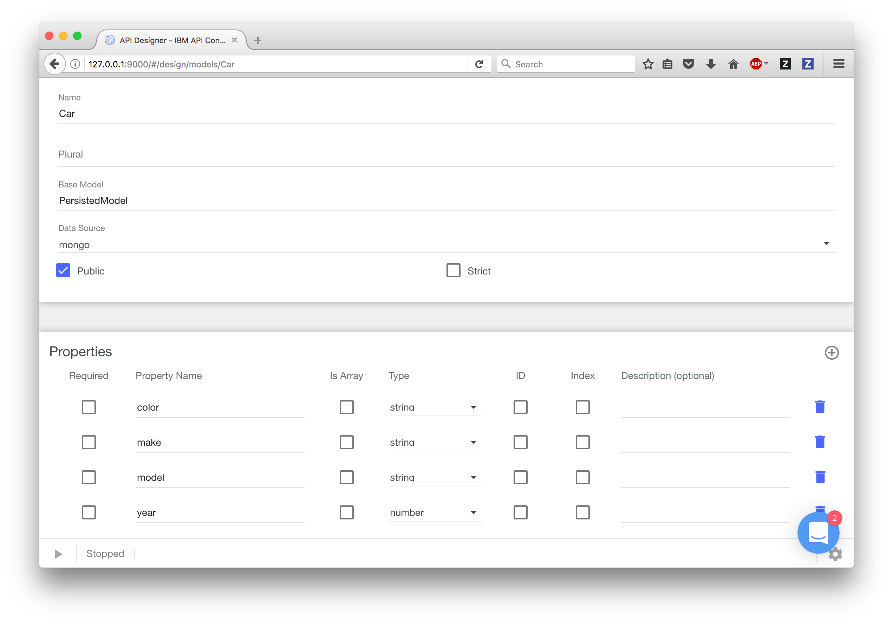
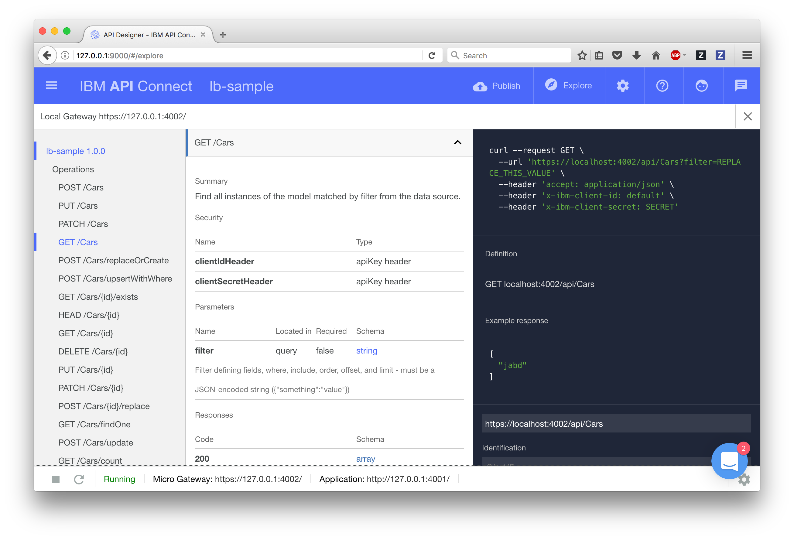

# Create an API Microservice

In this exercise, you will create a set of APIs using LoopBack, and open-source Node.js framework for creating applications. These APIs will allow us to perform CRUD (create, read, update and delete) operations on database entries.

## Create a Mongo Database

To perform CRUD operations, you'll need first need to create and start a DB. On your master VM, run the following command:
```
docker run --name my-mongo -p 27017:27017 -d mongo
```
That's it! You've created a MongoDB that you can now use to perform CRUD operations. This database is accessible on port 27107 at the same IP that you identified in [Exercise 1](../ex1/README.md). In the next step, we'll create an application that will allow you to work with your newly created database.

## Scaffold a sample LoopBack Application

To stay organized, let's start with creating a workspace directory:
```
mkdir ~/workspace
cd ~/workspace
```

Create an empty folder for your application code.
```
mkdir sample-lb
cd sample-lb
```

Run `apic loopback`. When prompted, choose the "empty-server" option:
```
$ apic loopback

? What's the name of your application? sample-lb
? What kind of application do you have in mind? empty-server (An empty LoopBack API, without any configured models or datasources)

...clipped...

Next steps:

  Change directory to your app
    $ cd /Users/svennam/IC2017/sample-lb

  Create a model in your app
    $ apic create --type model

  Compose your API, run, manage, enforce and deploy it with API Connect
    $ apic edit

  Run the app
    $ apic start
```

You'll see that it scaffolds your application by creating a Node.js project with code ready to go. It then automatically runs `npm install` to fetch the dependencies your application needs to run.

## Launch the API Connect toolkit

API Connect comes with a toolkit that allows you to visually create, test and deploy APIs. To launch it, simply run `apic edit` from the directory of your application.

The first time you open it, it may ask you to log-in. If you have a Bluemix account, you can use it to log-in. Otherwise, you can set the `SKIP_LOGIN=true` option to launch apic edit:
```
SKIP_LOGIN=true apic edit
```

## Configure your DB connection

Click the Data Sources tab along the top and click the `Add` button. Name your DB `mongo` and press `New`. In the next window, under `Connector` choose `MongoDB`. It will prompt you to install the connector - follow the prompts to install the connector. You'll only need to enter two more fields - the `Host` and `Port`. For `Host`, enter the same IP from [Exercise 1](../ex1/README.md). For `Port`, use 27017. Hit save - this will test the connection and should come back successful.

## Configure a Model

Next, we'll need to define the type of object we want to store in the Database. Jump to the Models tab and `Add` a new model. You can get creative here with what type of object you want to store, but here is an example model I've created to represent a simple car:



## Explore your APIs

After launching the toolkit, you can start your API application on your machine and start testing the APIs. To do so, press the play button on the bottom of your window - this starts the LoopBack application along with an API gateway. Wait for it to start - it should take less than 10 seconds. Next, hit the Explore button on the top right which launches a Swagger-based view (Open API Spec) of the APIs that are available.

Along the left side, you should see a number of operations with the model that you created in the previous step. Let's try calling a series of these operations.

#### GET /<Model>

Let's test retrieving the list of objects for the Model you created earlier.

Navigate to the operation `GET /<Model>`. Along the right side, there is a black section which shows you how to call that operation, provides boiler code, and has a button "Call Operation". Hit the button to call your GET operation.



You might get a CORS error. Override the CORS error by clicking the link, adding the exception, and then closing the tab. Then retry the `Call Operation`.

You should see a `200 OK` response but an empty array - this is because we haven't added any objects to the DB yet.

#### POST /<Model>

Let's test adding an object to the database.

Navigate to the operation `POST /<Model>` to create a database entry. Scroll down to the "Call Operation" button, enter some data into the Parameters section (or use the `Generate` button), and hit `Call Operation`.

You should see a `200 OK` response, as well as a response body indicating that the database update has succeeded. You can call `GET /<Model>` again to retrieve the stored objects.

## Next steps
Now that you've created an API microservice, you'll need to dockerize it before you deploy it to the swarm. In the next step, you'll [create a Docker image from the application you just created](../ex4/README.md).
